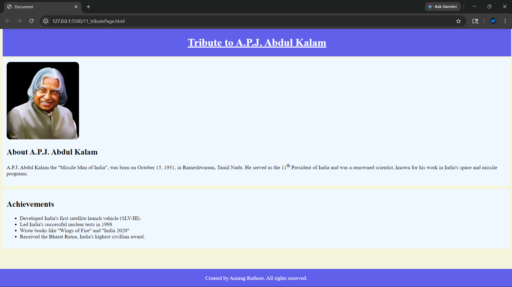
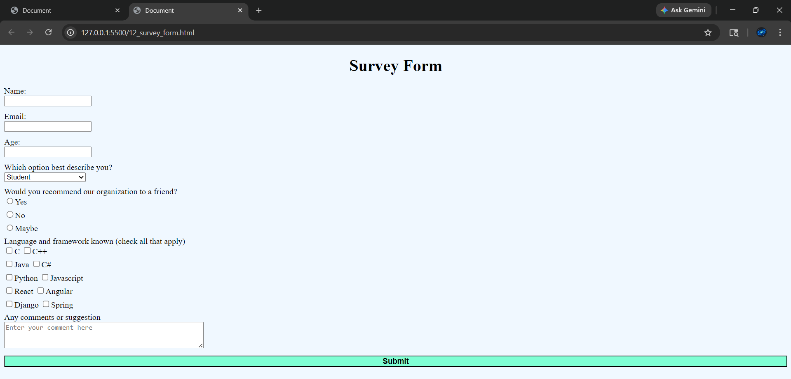

# ◉ Project 11 — Tribute Surface Layer

A contained structure.  
Some intention. Some noise. Some placement of elements that exist because they can.

Nothing here is dynamic.  
Nothing here adapts.  
It simply renders.

---

## ◉ Navigation Drift Map

- [11_tributePage.html](#output-fragment-zone)
- [11_style.css](#css-layer-zone)
- [12_survey_form.html](#output-fragment-zone)
- [12_style.css](#css-layer-zone)
- [FAQ Page](#output-fragment-zone)
- [FAQ Page Style sheet](#css-layer-zone)
---

---

## ◉ Output Fragment Zone

Below is the visible result as screenshot of all HTML files.

Everything above leads here.  
Everything here is the final surface.

---

---

## ◉ Post-Observation Layer

You have now seen the output.

There is nothing more hidden beneath.

No deeper logic.  
No evolving state.

Just:
- structure
- style
- rendering

---

## ◉ End State

This file is complete.

Or incomplete.

Depends on expectation.

Either way —  
nothing else follows.- Static layout
- Content blocks arranged in linear perception
- No dynamic interference
- Pure structure, no intelligence

---

## ◉ CSS Styling Zone

This layer wraps the structure in visual intention.  
Not necessary for existence, but necessary for perception.

Reference file:
- `11_style.css`

Properties include:
- Alignment distortions
- Color assertions
- Spacing decisions that may or may not matter

---

## ◉ File Mapping Layer

Direct access to fragments:

- [Open HTML File](./11_tributePage.html)
- [Open CSS File](./11_style.css)

Internal mapping:

- HTML → defines existence  
- CSS → defines appearance  
- README → defines interpretation  

---

## ◉ Execution Notes

To observe the artifact:

1. Open `11_tributePage.html`
2. Let browser interpret it
3. CSS attaches automatically (if linked correctly)
4. Output appears — whether meaningful or not

No build process. No compilation. No complexity.

---

## ◉ Residual Thoughts

This project does not evolve.  
It simply exists.

A tribute page is not about logic —  
it is about presentation of something already decided.

You are not interacting with a system.  
You are observing a fixed outcome.

---

## ◉ End Marker

No further sections.  
Nothing hidden below.  
Nothing waiting.
